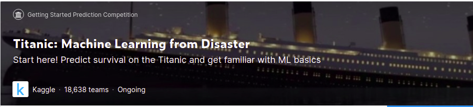
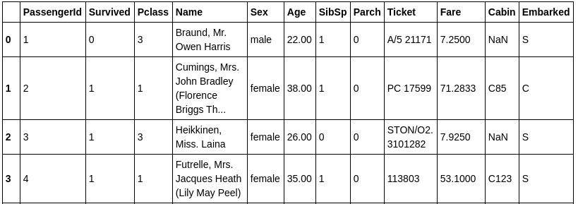

# Titanic: Machine Learning from Disaster

Usando Machine Learning para crear un modelo que prediga que pasageros sobrevivieron al naufragio del Titanic.

El reto consiste en crear un modelo predictivo que responda a la pregunta **¿Qué tipo de personas tenían más probabilidades de sobrevivir ?** usando los datos de los pasajeros (nombre, edad, genero ..)

# Datos

`train.csv` contiene los detalles de un subconjunto de los pasajeros a bordo (891 para ser exactos) y lo que es importante revela si sobrevivieron o no.

`test.csv` conjunto de datos (418) que contiene información similar pero no contiene la columna **Survived**. El reto consiste en predecir este resultado.

Usando los partrones encontrados en los datos de train.csv se debe precedir si los 418 pasageros a bordo (encontrados en test.csv) sobrevivieron.
